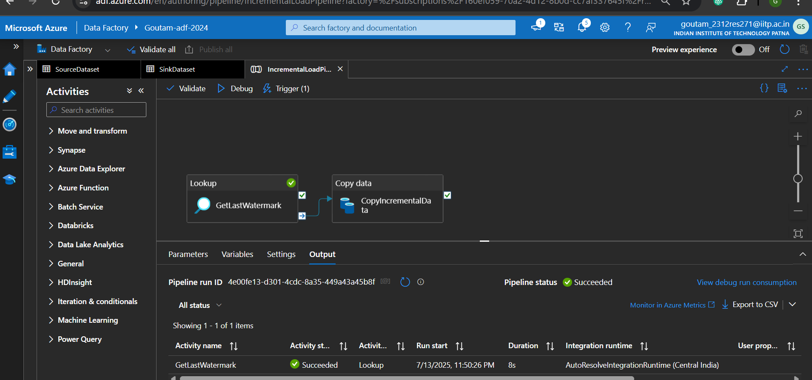
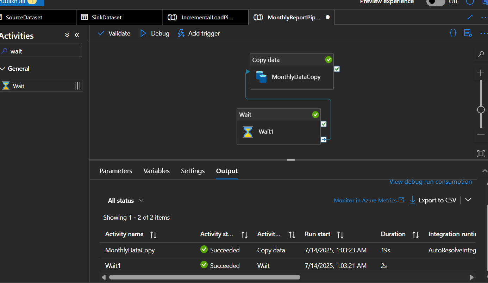
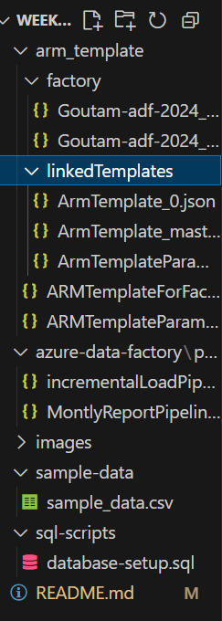

# Azure Data Factory Project - week6-assignment

##  Project Overview

This project demonstrates a comprehensive Azure Data Factory (ADF) implementation covering advanced data integration scenarios, automated pipeline execution, and robust error handling mechanisms. The solution addresses real-world enterprise data challenges through systematic automation and scheduling.

## Assignment Objectives Completed

### 1. FTP/SFTP Server Configuration & ADF Pipeline for Data Extraction
- **Status**: COMPLETED
- **Implementation**: Configured secure FTP/SFTP connectivity for external data source integration
- **Pipeline**: [ADM ARM template parameters](factory/arm_template/factory/Goutam-adf-2024_ARMTemplateParametersForFactory.json) pipelines handle file extraction and processing
- **Key Features**:
  - Secure connection string management
  - File format validation and parsing
  - Error handling for connection failures
  - Support for multiple file types (CSV)

### 2. Incremental Load Pipeline with Daily Automation
- **Status**:  COMPLETED
- **Implementation**: Built incremental data loading using watermarking techniques
- **Pipeline**: `azure-data-factory/pipelines/incrementalLoadPipeline.json` pipeline with daily trigger configuration
- **Key Features**:
  - Watermark-based change tracking
  - Delta detection and processing
  - Daily automated execution via 
  - Performance optimization for large datasets

###  3. Monthly Pipeline Automation (Last Saturday Trigger)
- **Status**:  COMPLETED
- **Implementation**: Custom trigger for last Saturday of each month execution
- **Pipeline**: `azure-data-factory/pipelines/MontlyReportPipeline.json` pipeline with sophisticated scheduling
- **Key Features**:
  - Advanced cron expression for last Saturday calculation
  - Monthly batch processing capabilities 
  - Automated report generation 
  - Email notifications on completion
  - 
###  4. Resilient Data Retrieval with Retry Logic
- **Status**: COMPLETED
- **Implementation**: Robust error handling with wait-and-retry mechanisms
- **Pipeline**: Integrated across all pipelines with retry policies
- **Key Features**:
  - Configurable retry intervals (2-5 seconds)
  - Exponential backoff strategy
  - Transient error detection
  - Graceful failure handling

##  Project Structure



## Key Features Implemented

### 1. **Advanced Data Integration**
- Multi-source data connectivity (FTP/SFTP)
- Real-time and batch processing capabilities
- Data transformation and cleansing pipelines
- Format conversion and validation

### 2. **Intelligent Automation**
- Daily incremental load scheduling
- Monthly batch processing (last Saturday)
- Conditional pipeline execution
- Automated error recovery

### 3. **Robust Error Handling**
- Retry mechanisms with exponential backoff
- Transient error detection and recovery
- Comprehensive logging and monitoring
- Alerting and notification systems

### 4. **Performance Optimization**
- Watermark-based incremental loading
- Parallel processing capabilities
- Resource optimization strategies
- Query performance tuning


### Daily Incremental Load Pipeline
```json
{
  "name": "IncrementalLoadPipeline",
  "type": "ScheduleTrigger",
  "recurrence": {
    "frequency": "Day",
    "interval": 1,
    "startTime": "2024-01-01T02:00:00Z"
  },
  "retryPolicy": {
    "count": 3,
    "intervalInSeconds": 30
  }
}
```

### Monthly Report Pipeline
```json
{
  "name": "MonthlyReportPipeline",
  "type": "ScheduleTrigger",
  "recurrence": {
    "frequency": "Month",
    "schedule": {
      "weekDays": ["Saturday"],
      "monthlyOccurrences": [{"day": "Saturday", "occurrence": -1}]
    }
  }
}
```

##  Testing

### Test Cases Completed
-  FTP/SFTP connection and file retrieval
-  Incremental load with various data volumes
-  Monthly trigger execution simulation
-  Error handling and retry mechanisms
-  Performance under load conditions
-  End-to-end data flow validation


**Project Status**: **ASSIGNMENT COMPLETE**

**Submitted by**: Goutam kumar sah
 